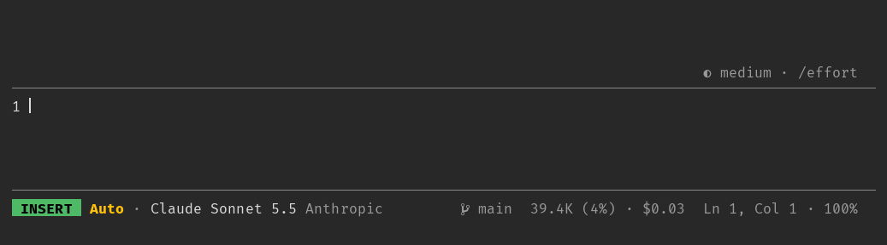
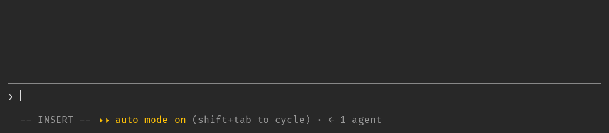
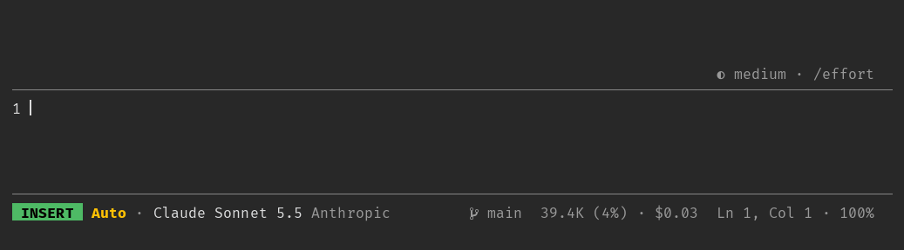
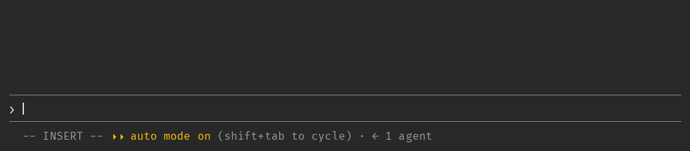
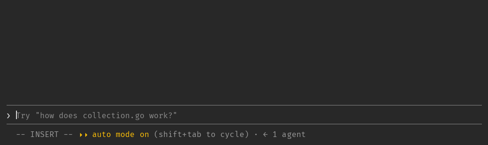
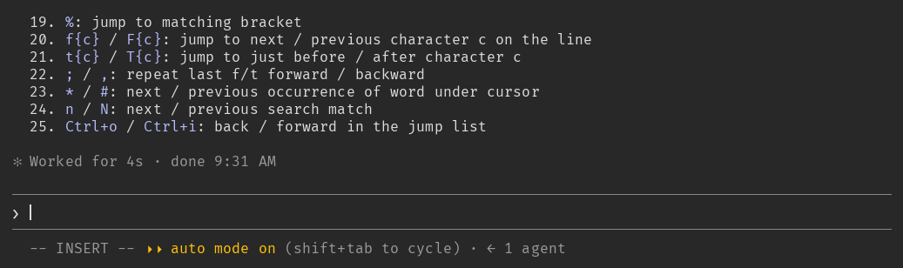

# claude-x

My opinionated mods for Claude Code.


The repo is a **plugin marketplace**: a catalogue (`.claude-plugin/marketplace.json`) that lists
the plugins kept in it, each in its own folder under `mods/`. Claude Code installs plugins only
through a marketplace, so adding this one lets any machine install any of the mods, alone or
together, and update them as they change.

## Mods

### statusline

A vim-style status bar in the footer: editor mode, permission mode, model, effort, git state, usage
and cursor. Numbers the draft's lines and keeps the prompt box taller; `/expand` (Ctrl+X x) makes it
taller still until the next prompt.



[README](mods/statusline/README.md) · [options](mods/statusline/README.md#options) · [a taller prompt](mods/statusline/README.md#a-taller-prompt)

### syntax

Colors the draft as it is typed: its markdown, the code in its fences, and in shell mode the command.



[README](mods/syntax/README.md) · [known issues](mods/syntax/README.md#known-issues)

### vim

A vim command line: `:w` and `:e` keep a draft per session, `:q` quits, any other name runs that slash
command, with Tab completion. Drawn in `statusline`'s bar, so the demo has both.



[README](mods/vim/README.md) · [commands](mods/vim/README.md#commands) · [drafts](mods/vim/README.md#drafts)

### attachments

The draft's attachments as chips above the prompt: pasted pictures and texts, `@`-mentioned files
and folders, and with `issues` each `@#N` issue, with a glyph for its type, its path and what it is,
and a `×` to take it out.



[README](mods/attachments/README.md) · [what a chip shows](mods/attachments/README.md#what-a-chip-shows) · [limits](mods/attachments/README.md#limits)

### issues

The repository's GitHub issues as `@#` is typed: a list above the prompt filtered by number or title,
picked with a click or Ctrl+X Tab, and each `@#N` sent with the issue for the model to read.



[README](mods/issues/README.md) · [picking one](mods/issues/README.md#picking-one) · [what the model reads](mods/issues/README.md#what-the-model-reads)

### stfu

The line drawn while Claude works without its whimsical word: only the time, tokens and thinking,
where Claude Code draws them. The closing `Baked for 3s` reads `Worked for 3s`.



[README](mods/stfu/README.md) · [why a blank and a verb](mods/stfu/README.md#why-a-blank-and-a-verb)

Each works alone, and they fit together: `vim` draws its line in `statusline`'s bar, `syntax`
reads the editor's mode from `statusline` to color a shell command, `attachments` shows each issue
`issues` loads for the draft as a chip, and both share the band above the prompt with `vim`'s field. A mod reads another's state and never writes
it, so none depends on another being installed.

## Install

```sh
claude plugin marketplace add thefuga/claude-x   # once per machine
claude plugin install statusline@claude-x        # then any of the mods
claude plugin install syntax@claude-x
claude plugin install vim@claude-x
claude plugin install attachments@claude-x
claude plugin install issues@claude-x            # needs gh, logged in
claude plugin install stfu@claude-x
```

`claude plugin marketplace update claude-x` takes up new versions; `claude plugin disable <mod>@claude-x`
turns one off.
