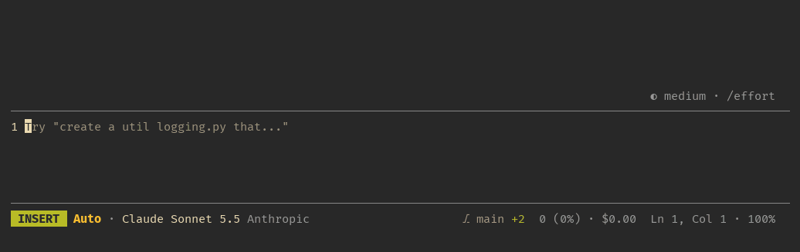

# claude-x

My opinionated mods for Claude Code.



The repo is a **plugin marketplace**: a catalogue (`.claude-plugin/marketplace.json`) that lists
the plugins kept in it, each in its own folder under `mods/`. Claude Code installs plugins only
through a marketplace, so adding this one lets any machine install any of the mods, alone or
together, and update them as they change.

## Mods

| Mod | What it does | Read more |
| --- | --- | --- |
| **statusline** | A vim-style status bar in the footer: editor mode, permission mode, model, effort, git state, usage and cursor. Numbers the draft's lines and keeps the prompt box taller. | [README](mods/statusline/README.md) · [options](mods/statusline/README.md#options) · [a taller prompt](mods/statusline/README.md#a-taller-prompt) |
| **syntax** | Colors the draft as it is typed: its markdown, the code in its fences, and in shell mode the command. | [README](mods/syntax/README.md) · [known issues](mods/syntax/README.md#known-issues) |
| **vim** | A vim command line: `:w` and `:e` keep a draft per session, `:q` quits, any other name runs that slash command, with Tab completion. | [README](mods/vim/README.md) · [commands](mods/vim/README.md#commands) · [drafts](mods/vim/README.md#drafts) |
| **attachments** | The draft's attachments as chips above the prompt: pasted pictures and texts, and `@`-mentioned files and folders, each with a glyph for its type, its path and what it is, and a `×` to take it out. | [README](mods/attachments/README.md) · [what a chip shows](mods/attachments/README.md#what-a-chip-shows) · [limits](mods/attachments/README.md#limits) |

Each works alone, and they fit together: `vim` draws its line in `statusline`'s bar, `syntax`
reads the editor's mode from `statusline` to color a shell command, and `attachments` shares the
band above the prompt with `vim`'s field. A mod reads another's state and never writes it, so none
depends on another being installed.

## Install

```sh
claude plugin marketplace add thefuga/claude-x   # once per machine
claude plugin install statusline@claude-x        # then any of the mods
claude plugin install syntax@claude-x
claude plugin install vim@claude-x
claude plugin install attachments@claude-x
```

`claude plugin marketplace update claude-x` takes up new versions; `claude plugin disable <mod>@claude-x`
turns one off.
